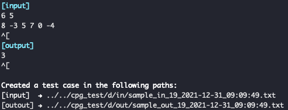
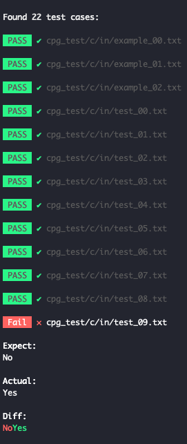

# Competitive Programming Grader for automating coding-testing loop

Competitive Programming Grader is a test automation tool for competitive programming.

CPG checks if all tests pass with one command.
You don't have to copy and paste the input value or check the output side by side with the answer each time you make a correction. This is useful when you have a myriad of test cases such as boundary value tests.

# Install
## MacOS
The procedure to install with `brew tap` is as follows.
1. `$ brew tap ryotabannai/cpg`
2. `$ brew install ryotabannai/cpg/cpg`

Upgrade

`$ brew upgrade ryotabannai/cpg/cpg`

Installation is complete when the following help appears with `cpg`.
```bash
Competitive Programming Grader for automating coding-build-testing loop

Usage:
  cpg [flags]
  cpg [command]

Available Commands:
  completion  Generate the autocompletion script for the specified shell
  help        Help about any command
  make        Make a test case for a problem X
  run         Run tests for a problem X

Flags:
  -h, --help          help for cpg
  -p, --prob string   Set problem

Use "cpg [command] --help" for more information about a command.
```

## Linux
Download the latest Linux executable file cpg_linux_amd64 from [Release page](https://github.com/RyotaBannai/competitive-programming-grader/releases) and add it to your path.


# Features
There are two main:
### `make`: make a test case as input / output pair
#### Example: 
`cpg make -p d.cpp`

The above command example creates a test case for answer d. The file name is important, and the file name determines the folder location for the test. If you want to create a test case for the same problem with a different file name, you can't just use d.cpp, so add a comment at the beginning of the file name and declare the `@cpg_dirspec` annotation.
`cpg make -p d2.cpp`
```cpp
/* d2.cpp 
@cpg_dirspec d 
*/
auto main() -> int {
  // you're awesome codes
}
```

The content of the input file reflects what you type after the `[input]` is displayed.
When you're done, type `esc` → `enter`.

The content of the output file reflects what you type after the `[output]` is displayed.
When you're done, type `esc` → `enter`.

To interrupt the input, type `q!` → `enter`.




The test is also executed for the test case created directly. In that case, use the same file name for both input / output.

input: `cpg_test/d/in/sample_1.txt`

output: `cpg_test/d/out/sample_1.txt`

### `run`: Run tests for all test cases
#### Example: 
`cpg run -p d.cpp`
The above command example runs a test case for answer d. The file name is important, and the file name determines the location folder for the test. Annotating `run` as well as `make` will run multiple files for the same problem against the same test case.

For example, the following command runs the test against the `d2.cpp` file in the test case of problem d：

`cpg make -p d2.cpp`

If the test fails, the expected value, output value, and the difference are displayed.



# Configs
You need to create and deploy a config file before you can start using it.

## Create
Example:
```toml
# for C++ 
[compile]
compile = true
command = "clang++ -std=c++14 -stdlib=libc++ {FILENAME}"
output_dir = "./"

[test]
testfile_dir = "./cpg_test"
```

- `compile`: `true` if the language needs to be compiled before execution, `false` if it is not necessary for script languages, etc.
- `command`: Set the compile-time command. Place the `{FILENAME}` placefolder in the position where the target file is stored when the command is executed.
- `output_dir`: The destination for an executable file. Set the executable file name to be `a.out`.
- `testfile_dir`: Folder to place test cases

```toml
# for C++ 
[compile]
command = "clang++ -std=c++14 -stdlib=libc++ -o ../../a.out {FILENAME}"
output_dir = "../../"
```


```toml
# for Python
[compile]
compile = false
command = "python {FILENAME}"
output_dir = "./"

[test]
testfile_dir = "./cpg_test"
```

## Deploy
The `cpg` command preferentially checks folders and searches for a config file as follows:
1. File path from environment variable `CPG_CONF_PATH`
2. Config folder + `/cpg/cpg_conf.toml` 
i.g. `$HOME/.config/cpg/cpg_conf.toml`
3. Current directory i.g. `./cpg_conf.toml`


# 日本語

Competitive Programming Grader は競プロにおけるテスト自動化ツールです。

コマンド一つで全てにテスト対しパスできているかどうかチェックします。
修正するたびに入力値をコピペしたり、出力を解答と横並びで確認する必要はありません。境界値テストなど無数のテストケースがあるときに有効です。

# Install
## MacOS
`brew tap` でインストールする手順は以下の通りです。
1. `$ brew tap ryotabannai/cpg`
2. `$ brew install ryotabannai/cpg/cpg`

アップグレード

`$ brew upgrade ryotabannai/cpg/cpg`

`cpg` で以下のようなヘルプが出ればインストール完了です。
```bash
Competitive Programming Grader for automating coding-build-testing loop

Usage:
  cpg [flags]
  cpg [command]

Available Commands:
  completion  Generate the autocompletion script for the specified shell
  help        Help about any command
  make        Make a test case for a problem X
  run         Run tests for a problem X

Flags:
  -h, --help          help for cpg
  -p, --prob string   Set problem

Use "cpg [command] --help" for more information about a command.
```

## Linux
[リリースページ](https://github.com/RyotaBannai/competitive-programming-grader/releases)から最新の Linux 用の実行ファイル cpg_linux_amd64 をダウンロードしパスへ追加してください。


# Features
主に２つです：
### `make`: テストケースを input/ output ペアで作成
#### Example: 
`cpg make -p d.cpp`

上記のコマンド例では、解答 d に対してテストケースを作成します。ファイル名は重要で、ファイル名をもとにテストの配置フォルダが決まります。異なるファイル名であるけれど、同じ問題に対しテストケースを作成したい場合は、d.cpp とするわけにはいきませんので、ファイル名の先頭にコメント追加し、 `@cpg_dirspec` アノテーションを宣言します。
`cpg make -p d2.cpp`
```cpp
/* d2.cpp 
@cpg_dirspec d 
*/
auto main() -> int {
  // you're awesome codes
}
```

input ファイルのコンテンツに `[input]` と表示された後に入力した内容が反映されます。
入力が完了したら `esc キー` → `enter キー` と打ちます。

output ファイルのコンテンツに `[output]` と表示された後に入力した内容が反映されます。
入力が完了したら `esc キー` → `enter キー` と打ちます。

途中で入力を中断するには `q!`  → `enter キー` と打ちます。


直接作成したテストケースに対してもテストは実行されます。その際は input/output ともに同じファイル名にします。

input: `cpg_test/d/in/sample_1.txt`

output: `cpg_test/d/out/sample_1.txt`

### `run`: 全テストケースに対しテストを実行します 
#### Example: 
`cpg run -p d.cpp`
上記のコマンド例では、解答 d に対してテストケースを実行します。ファイル名は重要で、ファイル名をもとにテストの配置フォルダが決まります。`make` と同様に `run` でもアノテーションをつけることで同じ問題に対する複数のファイルが同じテストケースに対して実行されます。

例えば、以下のコマンドでは `d2.cpp` ファイルに対し、問題 d のテストケースでテストが実行されます：

`cpg make -p d2.cpp`

テストに失敗した際には期待値と出力値、その差分を表示します。


# Configs
使用を開始する前にコンフィグファイルを作成、配置する必要があります。

## 作成
Example:
```toml
# for C++ 
[compile]
compile = true
command = "clang++ -std=c++14 -stdlib=libc++ {FILENAME}"
output_dir = "./"

[test]
testfile_dir = "./cpg_test"
```

- `compile`: 実行前にコンパイルが必要な言語なら `true`、スクリプト言語などで不要であれば `false`
- `command`: コンパイル時のコマンドを設定. `{FILENAME}` プレースフォルダはコマンド実行時に対象ファイルが入る位置におきます
- `output_dir`: 実行ファイルの吐き出し先. 実行ファイル名は `a.out` となるように設定します
- `testfile_dir`: テストケースを配置するフォルダ

```toml
# for C++ 
[compile]
command = "clang++ -std=c++14 -stdlib=libc++ -o ../../a.out {FILENAME}"
output_dir = "../../"
```


```toml
# for Python
[compile]
compile = false
command = "python {FILENAME}"
output_dir = "./"

[test]
testfile_dir = "./cpg_test"
```

## 配置
`cpg` コマンドは次のように優先的にフォルダを確認し、コンフィグファイルを探索します。
1. 環境変数 `CPG_CONF_PATH` のファイルパス
2. コンフィグフォルダ + `/cpg/cpg_conf.toml` 
i.g. `$HOME/.config/cpg/cpg_conf.toml`
3. カレントディレクトリ i.g. `./cpg_conf.toml`